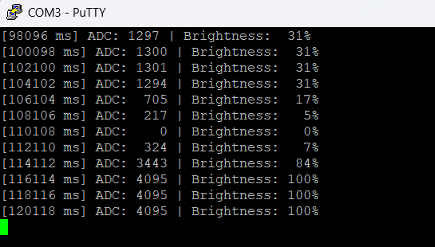
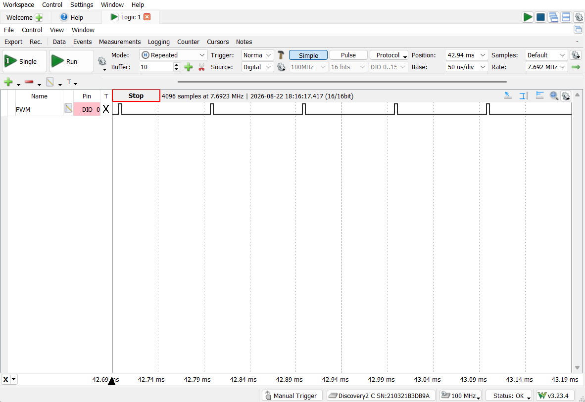
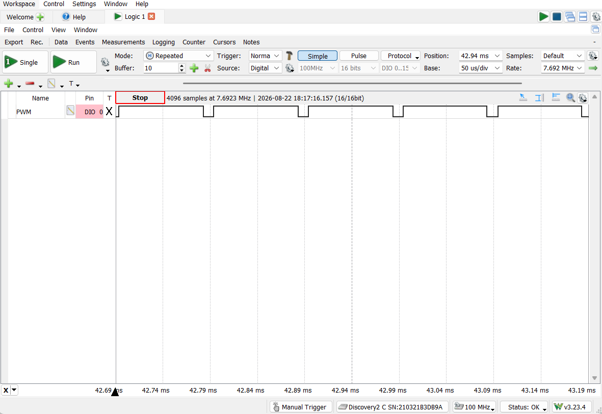

# ADC PWM Pipeline

A FreeRTOS-based producer/consumer/observer pipeline on the TM4C123GH6PM. A
potentiometer is sampled on a fixed period and converted into LED brightness
via hardware PWM, with a third task independently logging the pipeline's
status over UART. Three different FreeRTOS primitives - a single-slot
overwrite queue, a binary semaphore, and a mutex - each handle a distinct
part of the coordination between tasks.

## What it demonstrates
- **Precise periodic sampling** via `vTaskDelayUntil()` rather than
  `vTaskDelay()` - guarantees a fixed 50ms sampling period regardless
  of how long each sample actually takes to process, rather than
  drifting later each cycle
- **Producer/consumer signaling via a binary semaphore,** distinct from
  the direct task notification used in `led_blink_controller` and the
  event group used in `multi_sensor_hub`(see Design notes for why, in
  hindsight, a task notification would likely have been the better choice
  here)
- **A single-slot "latest value wins" queue using** `xQueueOverwrite()`, read
  by two independent tasks `xQueuePeek()` rather than `xQueueReceive`, so the
  value is never consumed/removed and both readers always see the same data
- Hardware PWM generation via Timer2A in split-pair mode, with the duty cycle
  recalculated in software on every new ADC sample
- Mutex-protected UART access, following the same pattern as `led_blink_controller`,
  `multi_sensor_hub`, and `unified_event_logger`
- Static/pool-only memory allocation, enforced by trapping the standard
  `malloc()`

## Architecture
- **`prvADCProducerTask`** - wakes every 50ms (via `vTaskDelayUntil()`),
  triggers ADC0 sequencer 3, and reads the potentiometer's raw 12-bit
  value from PE3. Writes that value into `xAdcQueue` with `xQueueOverwrite()`,
  then gives `xAdcSemaphore` to signal the consumer.
- **`prvPWMConsumerTask`** - blocks on `xAdcSemaphore`, consuming no CPU while
  idle. When signaled, it peeks (not removes) the latest ADC value from
  `xAdcQueue`, scales it into a Timer2A match value, and writes that directly
  into the timer hardware to update the PWM duty cycle on PB0.
- **`prvUARTLoggerTask`** - an independent third task on its own 2-second
  `vTaskDelay()` cycle, unrelated to the sampling rate. It also peeks the
  same queue, computes a human-readable brightness percentage, and prints
  both the raw ADC value and the percentage over UART, guarded by `xUartMutex`.

Both prvPWMConsumerTask and prvUARTLoggerTask read from the same single-slot
queue independently and non-destructively — neither task's read affects what
the other task sees.

## Hardware setup
- **Board:** TM4C123GXL Launchpad (TM4C123GH6PM)
- **Potentiometer:** external 10k potentiometer, wiper on PE3 (ADC0 AIN0),
  outer legs to 3.3V and GND
- **LED:** external LED with a current-limiting resitor (220Ω), anode to PB0
  (Timer2A/CCP0 PWM output), cathode to GND - not the onboard LaunchPad
  LED, since PB0 isn't one of its pins
- **UART:** UART0 on PA0 (RX) / PA1 (TX), 115200 8-N-1
- **No debug instrumentation pins used**: unlike the previous three projects
  mentioned, the signal being verified here (PB0's PWM output) is a real,
  directly probable pin - no artificial GPIO mirroring was needed to make
  internal behavior externally visible.

## Verified behavior

### UART pipeline log

*Captured terminal output showing the raw ADC value and computed brightness
percentage updating every 2 seconds as the potentiometer is turned.*

### PWM duty cycle at low and high input

*PB0 with the potentiometer turned almost fully down — a short high-time each
period (close to 0% duty cycle), captured directly on the PWM output pin.*

*PB0 with the potentiometer turned almost fully up — a long high-time each
period (close to 100% duty cycle), confirming the ADC-to-PWM scaling responds
correctly across the full input range.*

## Design notes / known limitations

- **Binary semaphore chosen over a direct task notification**: at the
  time this was built, a binary semaphore was the synchronization
  primitive that was understood well enough to apply confidently. In
  hindsight, since this is a single producer signaling a single specific
  consumer task — exactly the same shape of problem solved with a direct
  task notification in `led_blink_controller` — a notification would be
  the lighter-weight choice: no separate kernel object needs to be
  created, since the notification value already lives in every task's own
  TCB. The semaphore works correctly here and isn't a bug, just not the
  most efficient primitive available for this specific one-to-one
  relationship.
- **Queue depth must be 1, not just "1 is sufficient"**: the queue was
  originally sized at 5 with `xQueueOverwrite()`. This was a real bug —
  `xQueueOverwrite()` only replaces the last-written slot, while
  `xQueuePeek()` always reads from the front (oldest) slot. Once the
  queue filled past one entry, the "latest value" being overwritten and
  the "latest value" being peeked were no longer the same slot. Fixed by
  setting `ADC_QUEUE_DEPTH` to 1, which is what `xQueueOverwrite()` is
  actually documented by FreeRTOS to be designed for.
- **ADC noise + differing integer-division rounding causes a barely
  visible flicker near 0%**: with the potentiometer turned fully down,
  the ADC still reports small nonzero jitter (e.g., 3-4 out of 4095) from
  ordinary analog noise. Because `ulMatchValue` and `ulBrightness` are
  computed with two separate integer-division formulas, they round
  differently at this extreme: `ulBrightness = (3 * 100) / 4095` truncates
  to 0%, while `ulMatchValue = ulLoad - ((3 * ulLoad) / 4095)` leaves a
  few timer counts of nonzero on-time. The UART log reads a clean 0%
  while the LED still shows a faint, real flicker — a genuine numerical
  edge case, not a hardware fault or an "imperfect potentiometer" issue.
- **ADC completion is polled, not interrupt-driven**: same pattern as
  `multi_sensor_hub` — `prvADCProducerTask` busy-waits on
  `ADCIntStatus(..., false)` rather than routing the ADC's interrupt to
  the NVIC and blocking on a semaphore or notification. Valid per the
  datasheet, but spends CPU cycles the scheduler could otherwise use
  elsewhere while the conversion is in progress.
- **Static allocation only**: `malloc()` is intentionally trapped to halt
  execution if called, since the project relies entirely on FreeRTOS's
  own heap (`pvPortMalloc`) for all task/queue/semaphore/mutex creation —
  a deliberate fail-loud safety pattern rather than an oversight.

## How to build / run

**Toolchain**: Code Composer Studio (CCS), TivaWare C Series
(2.2.0.295), TM4C123GH6PM target.

**Prerequisites**:
- CCS with TivaWare C Series installed
- A local FreeRTOS source tree (this project was built against
  FreeRTOS's TivaWare CCS port; not included in this repository —
  download from [freertos.org](https://www.freertos.org))

1. Import this project folder into CCS as an existing project.
2. Ensure project include paths point to your local FreeRTOS and
   TivaWare installations (Project Properties → Build → Includes).
3. Wire a 10k potentiometer's wiper to PE3, outer legs to 3.3V/GND.
4. Wire an external LED (with current-limiting resistor) from PB0 to GND.
5. Build and flash to a TM4C123GXL Launchpad.
6. Open a serial terminal (e.g., PuTTY) at 115200 baud, 8-N-1, and turn
   the potentiometer to see the LED brightness and UART log respond.
