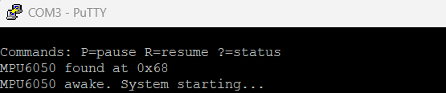
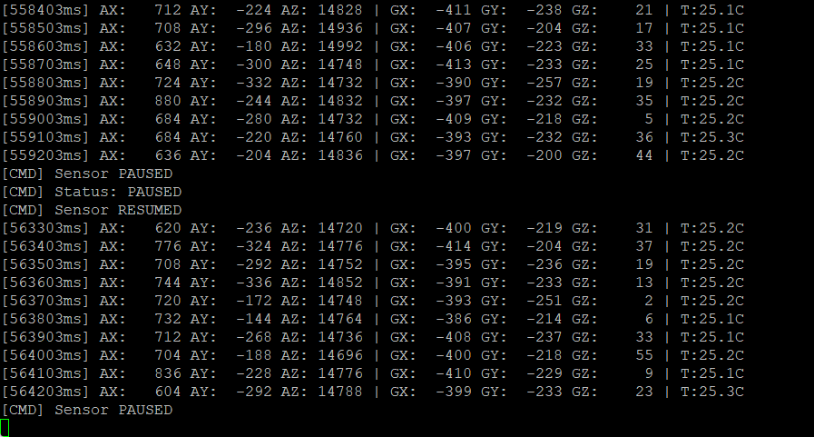
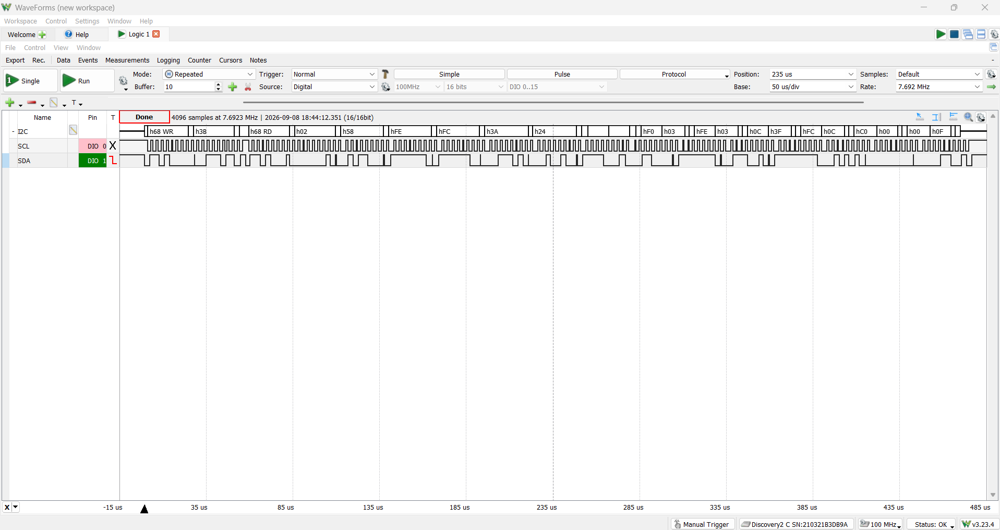
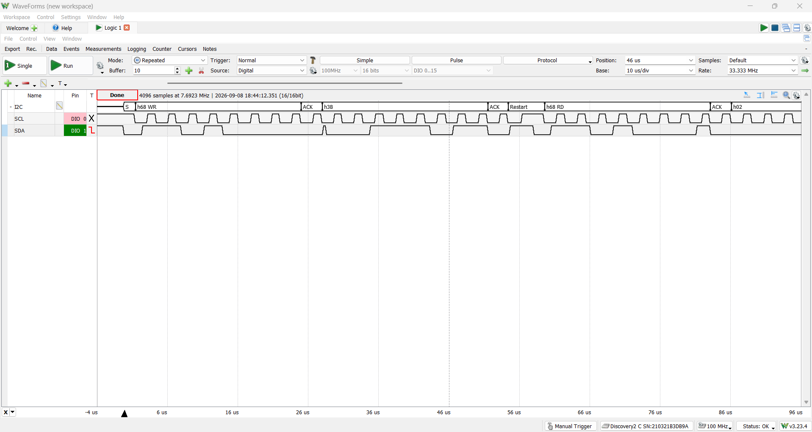
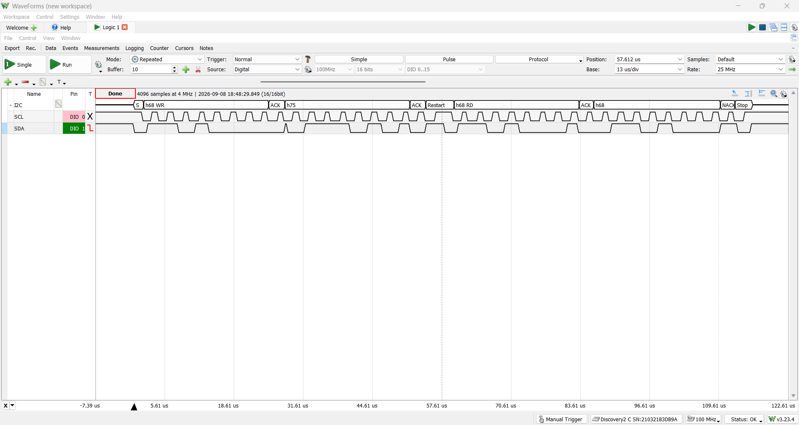

# I2C MPU6050 Hub

A FreeRTOS-based sensor acquisition and command interface on the TM4C123GH6PM.
An MPU6050 accelerometer/gyroscope/temperature sensor is sampled over I2C on
a fixed period, with a serial command interface allowing the sensor pipeline
to be paused, resumed, and queried live. Both I2C and UART are fully
interrupt driven - no busy-waiting anywhere in the design.

## What it demonstrates
- Fully interrupt-driven I2C master driver, using a state machine advanced
  entirely from the ISR and a binary semaphore to hand control back to the
  calling task once a transaction completes — no polling of I2C status
  flags anywhere in the transaction path
- Correct use of I2C repeated START for register reads, verified directly
  on a logic analyzer against the standard datasheet-defined read sequence
  (see Design notes for a real protocol bug found and fixed here)
- Fully interrupt-driven UART command interface: a UART0 RX interrupt
  notifies a waiting task directly via a FreeRTOS task notification, with
  the received byte carried in the notification value itself — no shared
  variable needed between ISR and task
- Counting semaphore as a producer/consumer signal between a periodic
  software timer and a sensor-read task, including a real backlog bug
  found and fixed during development (see Design notes)
- Queue as a decoupling handoff between sensor acquisition and UART
  printing, so a slow print never blocks the next sensor read
- Mutex-protected UART access shared genuinely concurrently across three
  tasks (sensor print, command response, startup banner) — unlike some
  simpler projects, this mutex is load-bearing, not defensive
- Startup sequencing constrained by the RTOS: sensor verification is
  deferred until after `vTaskStartScheduler()`, since the interrupt-driven
  I2C driver requires a running scheduler to block correctly
- Static/pool-only memory allocation, enforced by trapping the standard
  `malloc()`

## Architecture
Three independent paths converge on shared hardware and shared primitives:

- **Sensor path** — a FreeRTOS software timer (`prvSensorTimerCallback`)
  fires every 100ms, giving a counting semaphore (`xSensorSemaphore`,
  capacity 4). `vSensorReadTask` blocks on that semaphore, and on each
  give performs an interrupt-driven I2C burst read of all 14 bytes
  (accelerometer, temperature, gyroscope) from the MPU6050, then sends the
  parsed result into `xSensorQueue`.
- **Print path** — `vSensorPrintTask` blocks on `xSensorQueue`, and on
  each item received, formats and prints all axes plus temperature to
  UART0, guarded by `xUARTMutex`.
- **Command path** — a UART0 RX interrupt fires on every received byte.
  The ISR notifies `vCommandTask` directly via a task notification,
  passing the received character as the notification's value.
  `vCommandTask` blocks on `xTaskNotifyWait()`, consuming no CPU while
  idle, and handles `P`/`p` (pause), `R`/`r` (resume), and `?` (status).

All three paths share `xUARTMutex` when printing, since sensor data,
command responses, and the boot banner can all originate from different
tasks at effectively any time relative to each other.

I2C transactions themselves are handled by a dedicated interrupt-driven
driver (`i2c_driver.c`): a caller arms the I2C0 hardware for a single
transaction, then blocks on a binary semaphore
(`xSemaphoreTake(..., portMAX_DELAY)`). A state machine inside
`I2C0IntHandler` advances the transaction phase by phase — write register
address, repeated START, read data — and gives the semaphore from
interrupt context once the transaction completes (or errors), waking the
calling task. Because this blocking call requires a running scheduler,
sensor verification (`MPU6050_whoAmI`, `MPU6050_init`) is deferred to a
one-shot startup task (`prvStartupTask`) that runs after
`vTaskStartScheduler()`, rather than in `main()`.

## Hardware setup
- **Board**: TM4C123GXL Launchpad (TM4C123GH6PM)
- **MPU6050**: external breakout board
  - `VIN` → 3.3V
  - `GND` → GND
  - `SCL` → PB2 (I2C0 SCL)
  - `SDA` → PB3 (I2C0 SDA)
  - `AD0` → GND (selects I2C address 0x68)
  - `3Vo` and `INT` — left unconnected; `3Vo` is the breakout's own
    regulator output (not needed here), and `INT` (data-ready interrupt)
    is unused since this project samples on a fixed software timer period
    rather than reacting to the sensor's own interrupt output
- **I2C0**: 400 kHz Fast Mode
- **UART**: UART0 on PA0 (RX) / PA1 (TX), 115200 8-N-1

## Verified behavior

### Boot sequence and command interface

*Startup banner, sensor detection (`WHO_AM_I` returning 0x68), and sensor
initialization, confirming the startup task correctly verifies the sensor
before the sample timer is started.*

*Steady-state sensor output interleaved with `P`/`R`/`?` command
responses, confirming the interrupt-driven UART command path and the
pause/resume logic both work correctly under real use — including the
counting semaphore fix described below.*

### I2C read transaction

*A complete 14-byte burst read captured on SCL/SDA (PB2/PB3), showing the
full transaction from initial START to final STOP with all data bytes
returned.*

*Zoomed in on the boundary between the write phase (register address) and
the read phase (sensor data): a repeated START condition, with no STOP in
between — confirming the driver holds the bus for the entire transaction,
matching the standard I2C register-read pattern and protecting against
bus interleaving from another master.*

### I2C write transaction

*The one-time write to `PWR_MGMT_1` during `MPU6050_init()`, showing
START, register address, data byte, and STOP — a complete, single-phase
transaction with no repeated START needed, since a write has nothing
further to protect once the data byte is sent.*

## Design notes / known limitations

- **Counting semaphore backlog bug during pause (found and fixed)**: the
  100ms sensor timer originally gave `xSensorSemaphore` unconditionally,
  regardless of `bSensorPaused`. `vSensorReadTask` correctly skipped
  taking the semaphore while paused, but nothing stopped the timer from
  continuing to give — so tokens accumulated up to the semaphore's cap of
  4 during any pause longer than ~400ms. On resume, the read task would
  immediately succeed on four back-to-back takes, producing a burst of
  four rapid sensor reads before settling back into the normal 100ms
  rythm, rather than the clean, gap-free resume the design intended.
  Fixed by having `prvSensorTimerCallback` itself check `bSensorPaused`
  before giving, so no tokens accumulate on either side of a pause.

- **I2C read used a STOP-then-restart instead of a true repeated START
  (found and fixed)**: the read transaction's first phase originally used
  `I2C_MASTER_CMD_SINGLE_SEND`, which generates a full START...STOP
  transaction for the register-address write, followed by a separate,
  fresh START for the read phase — rather than a genuine repeated START
  holding the bus continuously across both phases. The MPU6050 happens to
  latch its register pointer across a STOP, so this likely worked in
  practice, but it didn't match the datasheet's standard read pattern and
  would not be safe on a multi-master bus, where another master could
  claim the bus during the STOP and interfere with the pending read.
  Fixed by using `I2C_MASTER_CMD_BURST_SEND_START` for the write phase
  instead, matching the write-transaction path's existing pattern, and
  confirmed correct via a logic analyzer capture showing a genuine
  repeated START with no STOP in between (see Verified behavior above).

- **UART command path converted from polling to interrupt-driven**: the
  command interface originally polled `UARTCharGet()` in a blocking loop.
  This works correctly but busy-waits on the UART hardware register
  whenever the command task has priority, rather than truly sleeping.
  Converted to a UART0 RX interrupt that notifies `vCommandTask` directly
  via `xTaskNotifyFromISR()`, carrying the received byte in the
  notification's value — avoiding the need for a separate shared variable
  between the ISR and the task entirely.

- **UART RX interrupt required both the byte-count and timeout triggers**:
  after converting to interrupt-driven UART, single keystrokes initially
  took 1–2 seconds to register. The UART hardware's RX FIFO only raises
  its "bytes available" interrupt (`UART_INT_RX`) once a configured number
  of bytes (commonly 2, at the default 1/8-full trigger level on a 16-byte
  FIFO) have accumulated — a single typed character never reaches that
  threshold on its own. Fixed by also enabling the receive timeout
  interrupt (`UART_INT_RT`), which fires once at least one byte is
  present and the line has gone idle for a short period, regardless of
  the count threshold — the correct mechanism for sparse, human-typed
  input rather than bulk data transfer.

- **Vector table wiring is exact-name-dependent**: the UART0 RX interrupt
  handler must be named `UART0IntHandler` and listed under that exact
  name in `startup_ccs.c`'s vector table (with a matching `extern`
  declaration), or the NVIC silently falls through to the default
  handler and the ISR never runs at all. This is the same pitfall
  documented for the I2C0 handler, and it was hit and fixed during this
  project's UART conversion.

- **Timestamp must be set after a successful sensor read, not before**:
  `sensor_task.c` originally set `xData.timestamp_ms` before calling
  `MPU6050_readAll()`, but that function unconditionally zeroes
  `dest->timestamp_ms` as part of populating the rest of the struct —
  silently overwriting the timestamp that had just been set. Fixed by
  moving the timestamp assignment to after a successful read. A related,
  separate bug in `print_task.c` — reading a fresh `xTaskGetTickCount()`
  at print time instead of the queued `xData.timestamp_ms` — was fixed
  first, which is what exposed the underlying zeroing bug once the
  correct field was finally being displayed.

- **UART mutex is genuinely required, not defensive**: unlike projects
  where only one task ever prints, `xUARTMutex` here protects UART0
  across three real concurrent callers — `vSensorPrintTask`,
  `vCommandTask`, and the one-shot `prvStartupTask` — any of which can
  attempt to print at effectively any time relative to the others.

- **`bSensorPaused` is `volatile` but not otherwise synchronized**: it's
  written by `vCommandTask` and read by `vSensorReadTask` with no mutex or
  atomic access. On a single-core Cortex-M, a single `bool` read/write is
  effectively atomic in practice, so the practical risk is low — but a
  fully rigorous implementation would use a critical section or another
  primitive rather than relying on `volatile` alone, which only prevents
  compiler-level caching/reordering and provides no synchronization
  guarantee by itself.

- **Static allocation only**: `malloc()` is intentionally trapped to halt
  execution if called, since the project relies entirely on FreeRTOS's own
  heap (`pvPortMalloc`) for all task/queue/semaphore/timer creation — a
  deliberate fail-loud safety pattern rather than an oversight.

## How to build / run

**Toolchain**: Code Composer Studio (CCS), TivaWare C Series
(2.2.0.295), TM4C123GH6PM target.

**Prerequisites**:
- CCS with TivaWare C Series installed
- A local FreeRTOS source tree (this project was built against
  FreeRTOS's TivaWare CCS port; not included in this repository —
  download from [freertos.org](https://www.freertos.org))

1. Import this project folder into CCS as an existing project.
2. Ensure project include paths point to your local FreeRTOS and
   TivaWare installations (Project Properties → Build → Includes).
3. Wire the MPU6050 as described in Hardware setup above.
4. Build and flash to a TM4C123GXL Launchpad.
5. Open a serial terminal (e.g., PuTTY) at 115200 baud, 8-N-1.
6. Sensor readings begin automatically once the sensor is verified at
   boot. Press `P` to pause, `R` to resume, or `?` for status at any
   time.
