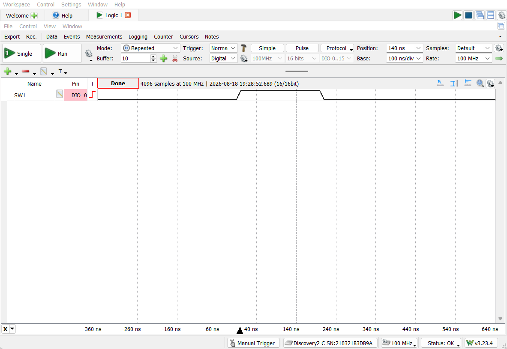
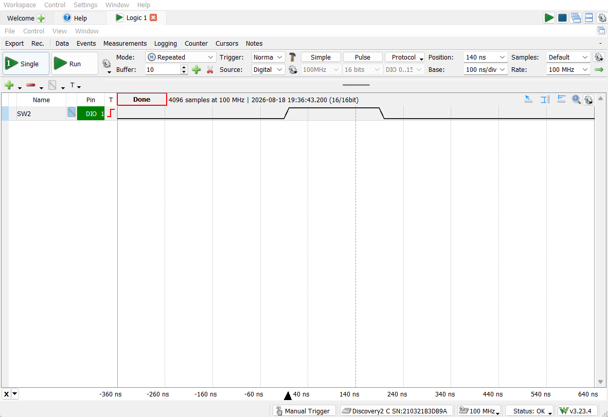
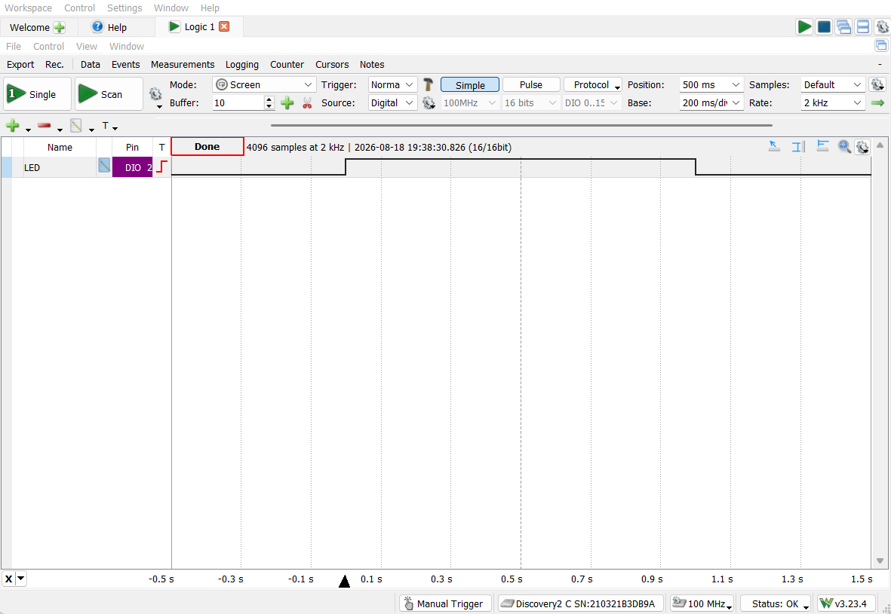
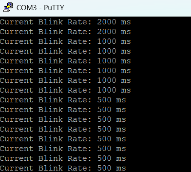

# LED Blink Controller

A FreeRTOS-based LED blink rate controller on the TM4C123GH6PM. A debounced
GPIO interrupt from either onboard button notifies a task directly, which
cycles through three fixed blink rates and pushes the new rate into a
1-deep queue. The LED task checks that queue without ever blocking on it,
so it starts blinking immediately at boot and simply keeps using its last
known rate whenever the queue happens to be empty, rather than stalling
indefinitely waiting for a first value to arrive.

## What it demonstrates
- ISR-to-task signaling via a **direct task notification**
  (`vTaskNotifyGiveFromISR()` / `ulTaskNotifyTake()`) — FreeRTOS's
  lightest-weight synchronization primitive, using a task's built-in
  notification value instead of a separate semaphore object
- A **non-blocking "latest value wins" queue pattern**: a 1-deep queue read
  with a zero timeout (`xQueueReceive(..., 0)`), so the consumer never
  stalls waiting for a new value — it just checks in passing and keeps
  using its last known rate if nothing's arrived
- Hardware button debounce handled in ISR context via timestamp comparison
- Correct use of `xHigherPriorityTaskWoken` / `portYIELD_FROM_ISR()` to
  force an immediate context switch to a newly-notified higher-priority
  task, rather than waiting for the next scheduler tick
- Debug GPIO instrumentation added to make button and LED events externally
  observable on a logic analyzer, since the onboard button/LED pins are too
  small to probe directly
- Static/pool-only memory allocation, enforced by trapping the standard
  `malloc()`

## Architecture
- **`xButtonsHandler`** — GPIO interrupt fired on a falling edge from
  either SW1 or SW2. Applies a 200ms software debounce (via timestamp
  comparison), then notifies `prvButtonTask` directly using
  `vTaskNotifyGiveFromISR()`.
- **`prvButtonTask`** — blocks on `ulTaskNotifyTake()`, consuming no CPU
  while idle. On notification, advances to the next rate in a fixed
  fast → slow → medium cycle and pushes it into `xBlinkRateQueue`.
- **`prvLEDBlinkTask`** — the blink loop itself. Each cycle it does a
  non-blocking check of `xBlinkRateQueue`; if a new rate is there, it's
  picked up immediately, otherwise the task just keeps using whatever rate
  it already had. It then toggles the LED on for that duration, off for
  that duration, and repeats.
- **`prvUARTStatusTask`** — an independent third task that reports the
  current blink rate over UART every 3 seconds, for visibility.

  ## Hardware setup
- **Board**: TM4C123GXL Launchpad (TM4C123GH6PM)
- **SW1 / SW2**: onboard buttons, configured for falling-edge interrupts
- **LED**: onboard red LED
- **UART**: UART0 on PA0 (RX) / PA1 (TX), 115200 8-N-1
- **Debug/verification pins (PC4–PC6)**: added solely to make internal
  button and LED events visible on a logic analyzer, since the onboard
  button/LED pins are too small to probe directly. These mirror existing
  signals and are not part of the project's core functionality:
  - PC4 — SW1 press event pulse
  - PC5 — SW2 press event pulse
  - PC6 — LED state mirror (tracks the LED's actual on/off period)

## Verified behavior

### Button press → rate change

*PC4 (SW1) — pulses on each debounced press.*

*PC5 (SW2) — same behavior, independent button.*

### LED blink rate

*PC6 mirrors the LED's actual on/off period — visually confirms the rate
change takes effect on the very next toggle after a button press, not
after some delay.*

### UART status log

*Captured terminal output showing the reported blink rate changing after
button presses, cycling through fast, slow, and medium.*

## Design notes / known limitations

- **SW1 and SW2 currently behave identically**: the original TI demo this
  project is based on had SW1 speed up and SW2 slow down the blink rate.
  In this implementation, `xButtonsHandler` notifies `prvButtonTask` the
  same way regardless of which button fired, and `prvButtonTask` simply
  advances to the next rate in a fixed cycle — so either button currently
  produces the same result. A future revision could branch on which
  button's status bit was set and cycle in opposite directions per button.
- **Shared global variables without synchronization**: `g_ui32CurrentRate`
  is written by `prvButtonTask` and read by `prvUARTStatusTask` with no
  mutex or atomic access guarding it; `g_ui32TimeStamp` is read/written
  inside the ISR and is `volatile` (preventing compiler reordering/caching
  issues) but not otherwise protected. On a single-core Cortex-M these
  particular 32-bit accesses are effectively atomic in practice, so the
  practical risk here is low, but it's still worth naming as the kind of
  pattern that becomes a real race condition on a more complex or
  multi-core system — correct fixes would be a mutex or an atomic access
  pattern rather than a bare shared global.
- **Non-blocking queue read is deliberate, not an oversight**:
  `prvLEDBlinkTask` reads `xBlinkRateQueue` with a zero timeout rather than
  blocking on it. A blocking read with `portMAX_DELAY` would leave the LED
  never blinking at all until the first button press ever occurred, since
  the task would sit there waiting indefinitely for a value that might not
  exist yet. The non-blocking read means an empty queue simply falls
  through to "keep using whatever rate I already have," so the LED starts
  blinking immediately at boot regardless of whether a button has been
  pressed.
- **Static allocation only**: `malloc()` is intentionally trapped to halt
  execution if called, since the project relies entirely on FreeRTOS's own
  heap (`pvPortMalloc`) for all task/queue creation — a deliberate
  fail-loud safety pattern rather than an oversight.

## How to build / run

**Toolchain**: Code Composer Studio (CCS), TivaWare C Series
(2.2.0.295), TM4C123GH6PM target.

**Prerequisites**:
- CCS with TivaWare C Series installed
- A local FreeRTOS source tree (this project was built against
  FreeRTOS's TivaWare CCS port; not included in this repository —
  download from [freertos.org](https://www.freertos.org))

1. Import this project folder into CCS as an existing project.
2. Ensure project include paths point to your local FreeRTOS and
   TivaWare installations (Project Properties → Build → Includes).
3. Build and flash to a TM4C123GXL Launchpad.
4. Open a serial terminal (e.g., PuTTY) at 115200 baud, 8-N-1.
5. Press SW1 or SW2 to cycle the LED's blink rate; watch the UART log
   update every 3 seconds.
