# Closed-Loop Motor Controller

A FreeRTOS-based DC motor speed controller on the TM4C123GH6PM, closing the
loop with quadrature encoder feedback through a PID controller, driving a
DRV8833 motor driver via hardware PWM. An INA260 current/voltage/power
monitor and TMP117 temperature sensor are sampled over a fully
interrupt-driven I2C driver, with the motor latching into a safe stopped
state on overcurrent or overtemperature. Speed and current telemetry is
broadcast over CAN at 500kbit/s to a second, independent node, a
STM32L476RG (Nucleo-64) running bare-metal, register-level firmware, which
also transmits its own periodic heartbeat frame back onto the same bus,
received and logged by the TM4C in turn.

## Repository layout

```
motor_controller/       TM4C123GH6PM project (this README's primary subject)
stm32_can_peer/         STM32L476RG CAN peer firmware (bare-metal, no HAL)
docs/                   Logic analyzer / oscilloscope / terminal captures
```

## What it demonstrates

- **A from-scratch, interrupt-driven I2C master driver**, rebuilt after the
  original implementation used `SINGLE_SEND` (a full STOP-then-restart) for
  its register-address write phase, the same protocol-correctness bug
  found and fixed in `i2c_mpu6050_hub`. The rebuilt driver uses
  `I2C_MASTER_CMD_BURST_SEND_START` to hold the bus across a genuine
  repeated START, verified directly against a logic analyzer capture
  showing no STOP condition between the write and read phases.
- **Honest, destination-pointer error reporting on every I2C call**: every
  public driver function returns `bool` and writes into a caller-supplied
  buffer, so a failed transaction can never be silently mistaken for valid
  data (the previous design returned raw sensor values directly, with no
  way to distinguish a real reading of 0 from a failed read).
- **A two-stage sensor validation model**: `sensors.c` answers "did the I2C
  transaction succeed," while `sensor_task.c` separately answers "is this
  value physically plausible", a failed I2C read and an implausible-but
  successfully-read value are logged and handled differently, and neither
  is allowed to silently overwrite the last known-good reading.
- **A latching overcurrent/overtemperature fault**, closing a real bug
  found during review: the original fault check used a bounded window
  (e.g. `current > 1000 && current < 2000`) with no upper bound and no
  early exit, so a "MOTOR STOPPED" message printed while the very next
  line in the loop re-commanded the motor via PID output. The corrected
  version trips on any reading *above* threshold, unconditionally skips
  the PID path via `continue`, and, deliberately, does not self-clear
  once tripped, since a reading dipping back under threshold does not mean
  the underlying condition is gone.
**A PI controller, honestly named** — the derivative term is present and
  active (`kd` non-zero, low-pass filtered before being applied), but the
  system ran and was documented as pure PI first, the derivative term was
  added afterward specifically to reduce settling time and tighten
  steady-state oscillation, and its filtering exists specifically because
  a raw derivative on 10ms-windowed QEI velocity data amplifies
  sample-to-sample encoder jitter into jumpy PWM output.
- **Quadrature encoder velocity + direction decode**, using the TM4C's QEI
  peripheral in hardware velocity-capture mode rather than manual
  position-delta timing in software, and a real direction-sign bug found
  on the bench: the encoder's reported direction was inverted relative to
  the motor driver's forward/reverse convention, causing PID to see a
  large positive error and drive output *against* the true rotation.
  Fixed via `QEI_CONFIG_SWAP`, confirmed by capturing the A/B phase
  relationship on an oscilloscope in both directions.
- **A two-node CAN bus**, TM4C123 and STM32L476RG, genuinely bidirectional:
  the TM4C transmits speed/current telemetry (ID `0x001`) and receives the
  STM32's heartbeat (ID `0x002`) via a dedicated, ID-filtered message
  object and ISR-to-task ` notification. The STM32 receives telemetry via a
  bxCAN filter bank and transmits its own heartbeat. Message object numbers
  (TM4C-local hardware slots) and CAN IDs (the shared, on-wire protocol)
  are kept deliberately distinct in the code and in this document.
- **A bare-metal STM32 CAN peer with no CubeMX/HAL** — STM32CubeIDE 2.x
  removed integrated CubeMX support, so this side of the project was built
  by pulling in CMSIS device headers only and writing clock, GPIO, USART2,
  and CAN1 configuration directly against peripheral registers.
- **An interrupt-driven UART pause/resume command interface**, adapted from
  the pattern built in `i2c_mpu6050_hub`, `P`/`R`/`?` handled via a UART0
  RX interrupt that hands the received byte to a waiting task through the
  notification value itself (`xTaskNotifyFromISR` with
  `eSetValueWithOverwrite`), muting only routine status output. `WARN:` and
  `FAULT:` lines are never gated, since diagnostics should not be
  silenceable.
- **A single-slot overwrite/peek queue** between the sensor producer and
  its two independent readers (the motor task and the CAN task),
  `xQueueOverwrite()`/`xQueuePeek()` rather than a destructive queue, since
  a normal queue would let the faster-polling motor task silently drain
  data before the CAN task ever saw it, the same fix pattern used in
  `adc_pwm_pipeline`.
- **Static/pool-only memory allocation**, enforced by trapping the
  standard `malloc()`.

## Architecture

Four TM4C tasks:

- **`vSensorTask`** (priority 2, 100ms) — reads the INA260 (current,
  voltage, power) and TMP117 (temperature) over the interrupt-driven I2C
  driver, applies plausibility filtering independent of I2C-success
  filtering, and writes the result into `xSensorQueue` via
  `xQueueOverwrite()`.
- **`vMotorTask`** (priority 3, highest, 10ms) — peeks the latest sensor
  reading, checks the latching overcurrent/overtemperature fault, and if
  clear, runs the PID loop against encoder-derived speed and commands
  the DRV8833 via PWM.
- **`vCANTask`** (priority 1, 100ms) — peeks the latest sensor reading,
  transmits speed + current telemetry on ID `0x001`, and non-blockingly
  checks for a heartbeat-received notification from the CAN0 RX ISR.
- **`vCommandTask`** (priority 1) — blocks on a task notification carrying
  a UART0-received byte, handling `P`/`R`/`?`.

All hardware initialization (`I2C_Init`, `CAN_Init`, `DRV8833_Init`,
`Encoder_Init`, `PID_Init`, `CMD_UART0RxInit`) happens in `main()` before
`vTaskStartScheduler()`, so no task's correctness depends on init ordering
relative to other tasks.

The STM32 peer runs a simple superloop: initialize clocks (MSI-sourced PLL
at 80MHz, see Design notes), USART2, and CAN1, transmit a heartbeat every
750ms, and print received telemetry frames from a CAN1 RX0 interrupt.

## Hardware setup

- **Boards**: TM4C123GXL LaunchPad (TM4C123GH6PM), STM32 Nucleo-64
  (STM32L476RG)
- **INA260** (current/voltage/power monitor): I2C0, `SCL`→PB2, `SDA`→PB3,
  `VIN+`/`VIN-` wired in series with the DRV8833's `VM` supply line (high-side
  current sensing)
- **TMP117** (temperature sensor): same I2C0 bus, address `0x48`
- **DRV8833** (motor driver): `AIN1`→PE4, `AIN2`→PE5 (PWM0, Generator 2,
  1kHz), `SLP` tied high to 3.3V (this board's `SLP` defaults low via an
  internal pull-down and disables the H-bridge if left floating), `VM`
  from a 6V DC supply via the INA260, `GND` common with the TM4C
- **Encoder**: QEI0, `PHA0`→PD6, `PHB0`→PD7 (PD7 requires the GPIO
  lock/commit sequence, since it defaults to NMI)
- **CAN0 / CAN1**: both boards via an SN65HVD230 transceiver each
  (`TM4C PB4/PB5`, `STM32 PA11/PA12`), `CANH`-to-`CANH`, `CANL`-to-`CANL`,
  120Ω termination at both bus ends, common ground between boards
- **STM32 USART2**: ST-Link virtual COM port, `PA2`/`PA3`, 115200 8-N-1
- **UART0** (TM4C): PA0/PA1, 115200 8-N-1

## Verified behavior

### I2C — repeated START, confirmed on a logic analyzer
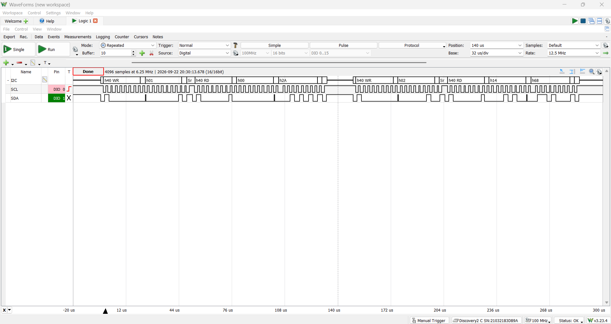
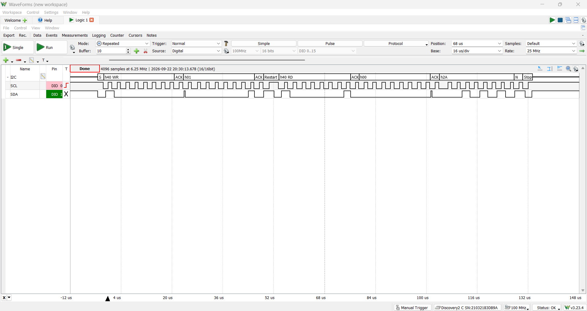
*Two consecutive INA260 register reads (current, then voltage), each
showing `Start → WR → ACK → Restart → RD → ACK...Stop` with no STOP
between the write and read phases, the rebuilt driver's repeated START,
confirmed consistent across independent transactions.*

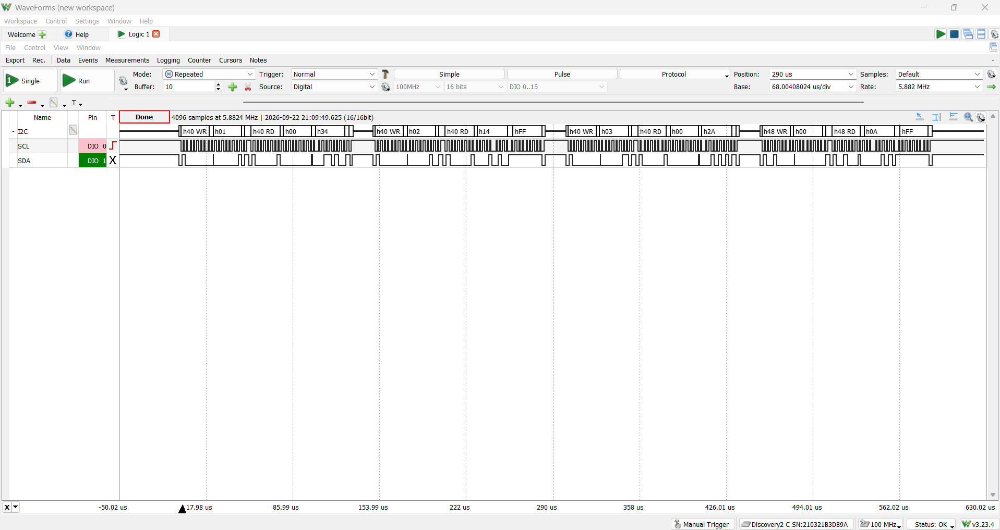
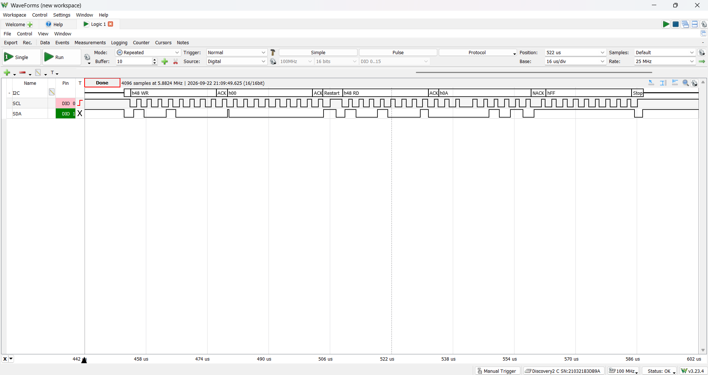
*A clean TMP117 read (address `0x48`) showing the same repeated-START
pattern, confirming the driver behaves consistently across both sensors
on the shared bus.*

### I2C — real electrical noise, caught on the wire
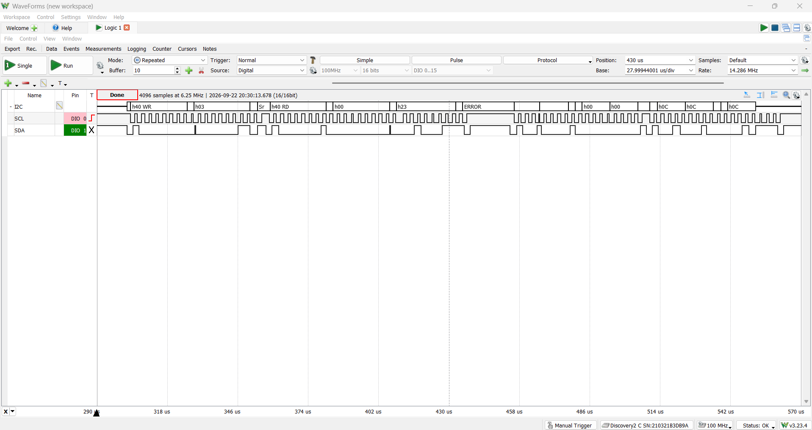
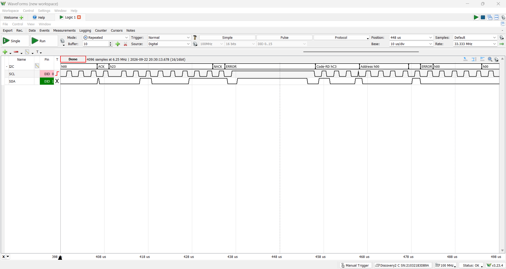
*A clean power-register transaction immediately followed by a genuine bus
glitch, `ERROR`/`PAR-ERROR` decoder flags with no corresponding valid
transaction. This is direct, on-the-wire evidence behind the intermittent
`WARN:`/corrupted-value behavior observed during testing (see Design
notes).*

### PWM — measured duty cycle matches the firmware's own claim
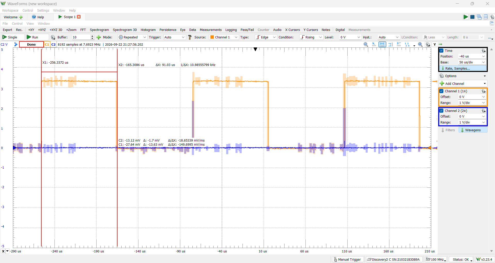
*`AIN1` (top) and `AIN2` (bottom) at the PID loop's converged steady
state. Measured high time ≈90µs of a 1ms period ≈9% duty cycle,
matching the UART log's own reported duty cycle at the same moment,
software and hardware independently agreeing.*

### Encoder — quadrature phase confirms the direction-sign fix
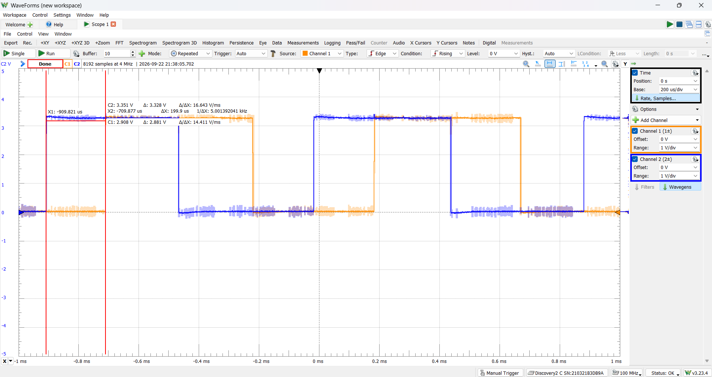
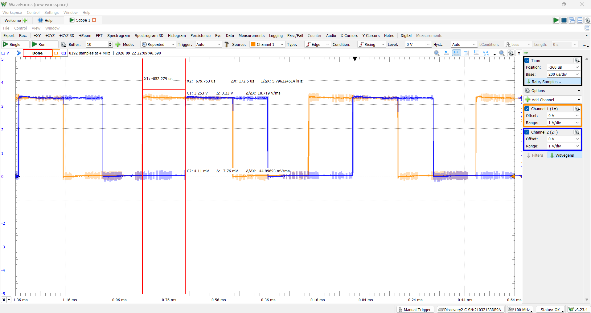
*`PHA0`/`PHB0` while the motor spins forward (top) and reverse (bottom),
the leading/lagging relationship between the two channels visibly
inverts between directions, confirming the mechanism behind the
`QEI_CONFIG_SWAP` fix described in Design notes.*

### CAN — bidirectional, confirmed from both nodes' own receive line
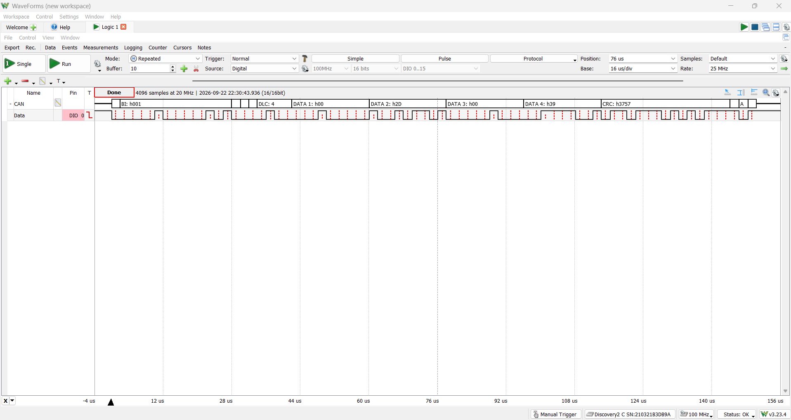
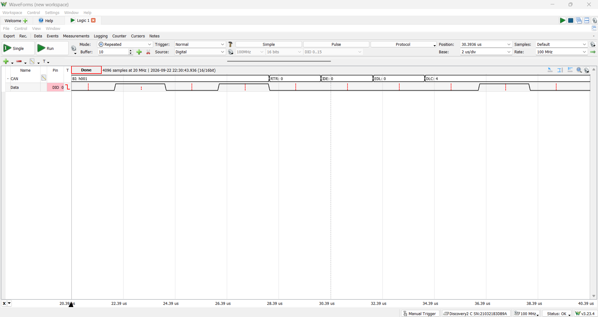
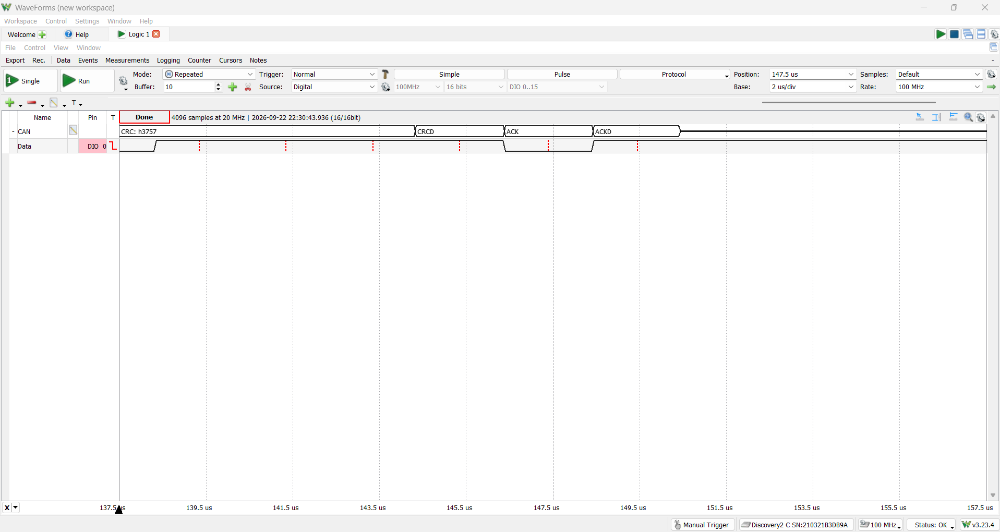
*A full `0x001` telemetry frame decoded from the TM4C's own transceiver
RXD line, with RTR/IDE/EDL and CRCD/ACK/ACKD fields visible, a dominant
ACK bit here is the STM32 confirming receipt.*

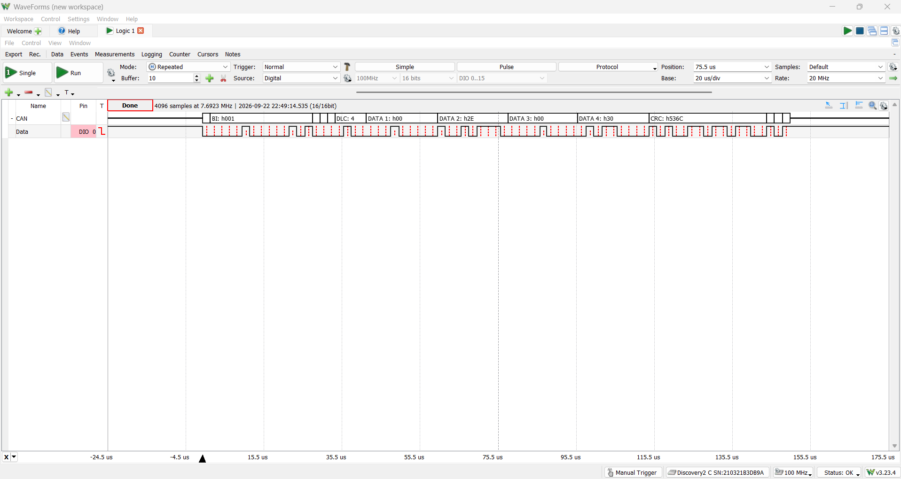
*The same telemetry frame, decoded independently from the STM32's own
RXD line, both nodes agree on what's on the bus.*

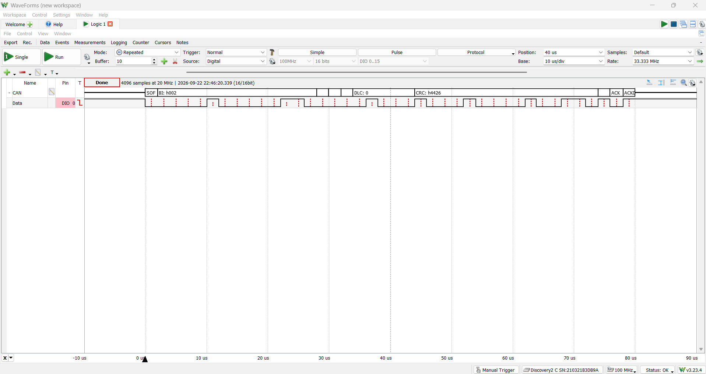
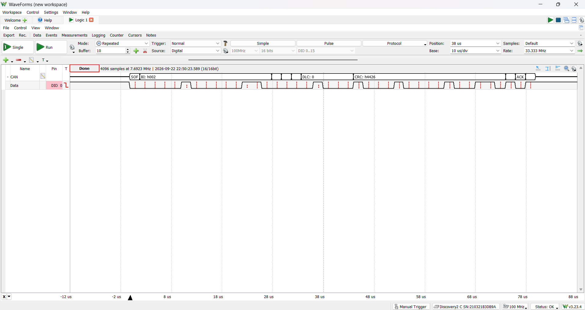
*The STM32's `0x002` heartbeat (0 data bytes), captured from both nodes'
own receive lines.*

### UART logs
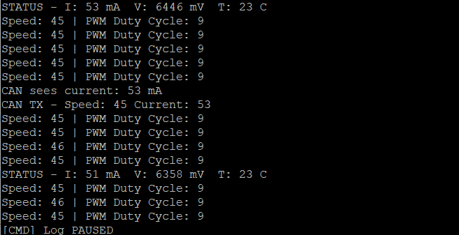

*Speed settling to within 1 count of the 45-count/10ms target, PWM duty
cycle converged and stable at 9-10%, after the derivative term was added
and filtered.*

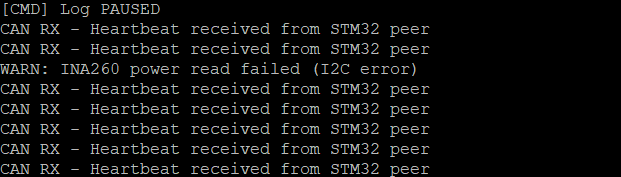
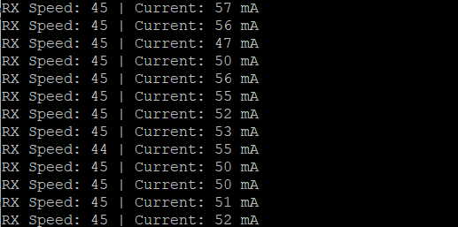

*Both terminals during simultaneous operation, the TM4C transmitting
telemetry and receiving heartbeats, the STM32 receiving and decoding that
same telemetry independently.*

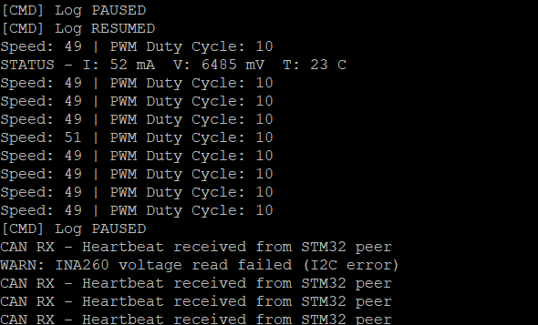

*`P`/`R`/`?` correctly muting and restoring routine status output.*

## Design notes / known limitations

- **The original overcurrent/overtemp check had two separate bugs, not
  one**: a bounded window (`current > 1000 && current < 2000`) meant
  readings *above* 2000 didn't trip the fault at all, and even inside
  the window, no `continue` followed `DRV8833_SetMotor(0)`, so the very
  next lines re-commanded the motor via PID output on the same iteration.
  The fix removed the upper bound and added an unconditional `continue`,
  and made the fault **latching** rather than self-clearing, a
  deliberate choice, since a reading dipping back under threshold does
  not mean the underlying fault condition has actually resolved. This
  behavior was directly observed on hardware (the motor tripped and
  stayed off during testing with a temporarily lowered threshold), but a
  dedicated terminal capture of that specific sequence was not saved.
- **`I2C_readWord`'s destination pointer was originally typed
  `uint8_t *` while the function body wrote a `uint16_t` through it**, a
  silent truncation bug caught by comparing the header declaration
  against the implementation, not by a compiler error. Fixed by
  correcting both to `uint16_t *`.
- **Two vector-table omissions found during bring-up**: the rebuilt I2C0
  ISR and the new CAN0 RX ISR were both, at different points, either
  missing from `startup_ccs.c`'s vector table or left pointing at
  `IntDefaultHandler`, meaning the associated FreeRTOS semaphore/
  notification would never be given, and the calling task would block
  forever with no error. Both were exact-name mismatches, the same class
  of pitfall documented in `i2c_mpu6050_hub` for its own UART0 handler.
- **A UART0 RX ISR draining its own notification's data (found and
  fixed)**: an earlier version of the pause/resume command handler read
  the received byte inside the ISR via `UARTCharGetNonBlocking()` before
  notifying the task, discarding the only copy of that byte, since the
  hardware FIFO is emptied by that same read. The task's own
  `UARTCharsAvail()` check then always found nothing. Fixed by having the
  ISR pass the byte directly through the notification value itself
  (`xTaskNotifyFromISR` with `eSetValueWithOverwrite`), so nothing needs
  to be re-read from a FIFO the ISR already emptied.
- **Intermittent I2C corruption, root cause not fully isolated**: `WARN:`
  messages and occasional `0xFFFF`-pattern garbage readings (the bus
  idling high when a transaction is interrupted) occurred during testing.
  A loose LaunchPad GND/3.3V connection was found and reseated but did
  not fully resolve the issue. The DRV8833's PWM switching is the most
  likely remaining noise source, though the exact coupling path (shared
  ground rail vs. another mechanism) was not conclusively confirmed. The
  existing two-stage validation (I2C-failure vs. plausibility) correctly
  catches and reports both failure modes without allowing corrupted data
  through to the control loop.
- **CAN bus-off detection exists but does not attempt recovery**: the
  TX-complete ISR path checks `CANStatusGet()` for a bus-off condition and
  reports it over UART, but recovering from bus-off (which requires
  re-initializing the CAN controller) is not implemented, a scoped,
  documented limitation rather than an oversight.
- **CAN arbitration was not directly captured**: the mechanism is
  understood and was deliberately tested for (including temporarily
  shortening the heartbeat interval to increase collision likelihood),
  but the millisecond-scale timing precision of two independently-clocked
  software loops made catching a genuine sub-microsecond arbitration
  event within a reasonable capture window impractical without
  synchronizing both boards' transmit timing far more tightly than this
  project required.
- **STM32 side built without CubeMX/HAL**: STM32CubeIDE 2.x removed
  integrated CubeMX support. Rather than install it standalone, this
  project pulls in CMSIS device headers only and configures clocks
  (MSI-sourced, since this specific Nucleo board does not connect the
  ST-LINK's MCO to HSE by default, `SB16`/`SB50` are open from the
  factory), GPIO, USART2, and CAN1 directly via register access.
- **Static allocation only**: `malloc()` is intentionally trapped to halt
  execution if called, since the project relies entirely on FreeRTOS's
  own heap (`pvPortMalloc`) for all task/queue/semaphore creation.

## How to build / run

**TM4C side**

**Toolchain**: Code Composer Studio (CCS), TivaWare C Series (2.2.0.295),
TM4C123GH6PM target.

**Prerequisites**:
- CCS with TivaWare C Series installed
- A local FreeRTOS source tree (built against FreeRTOS's TivaWare CCS
  port, not included in this repository, download from
  [freertos.org](https://www.freertos.org))

1. Import `motor_controller/` into CCS as an existing project.
2. Ensure project include paths point to your local FreeRTOS and TivaWare
   installations.
3. Wire the INA260, TMP117, DRV8833 + motor, encoder, and SN65HVD230 per
   Hardware setup above.
4. Build and flash to a TM4C123GXL LaunchPad.
5. Open a serial terminal at 115200 baud, 8-N-1. Press `P`/`R` to pause or
   resume routine status output, `?` for status.

**STM32 side**

**Toolchain**: STM32CubeIDE 2.x, no CubeMX/HAL dependency.

1. Create an "STM32CubeIDE Empty Project" targeting the NUCLEO-L476RG
   board.
2. Add CMSIS device headers (`stm32l476xx.h`, `system_stm32l4xx.h`) from
   [STMicroelectronics/cmsis_device_l4](https://github.com/STMicroelectronics/cmsis_device_l4)
   and core CMSIS headers (`core_cm4.h` and its dependencies) from
   [ARM-software/CMSIS_5](https://github.com/ARM-software/CMSIS_5) to a
   `Drivers` folder, and add that folder to the project's include paths.
3. Add the source files from `stm32_can_peer/` to the project.
4. Wire the second SN65HVD230 per Hardware setup above, sharing `CANH`/
   `CANL`/ground with the TM4C's bus.
5. Build and flash. Open a serial terminal on the ST-Link virtual COM
   port at 115200 baud, 8-N-1, to see received telemetry.
