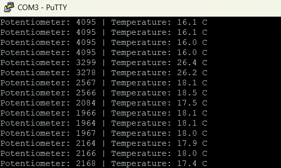
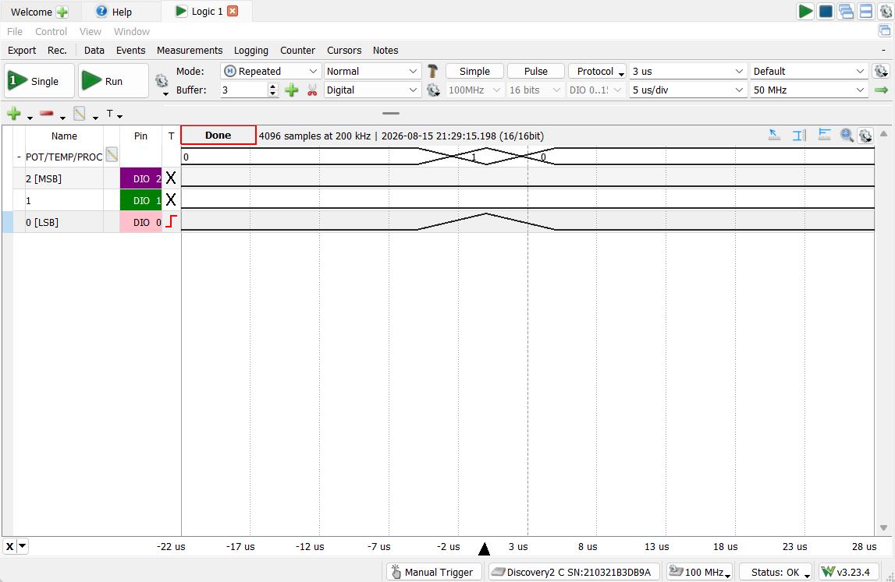
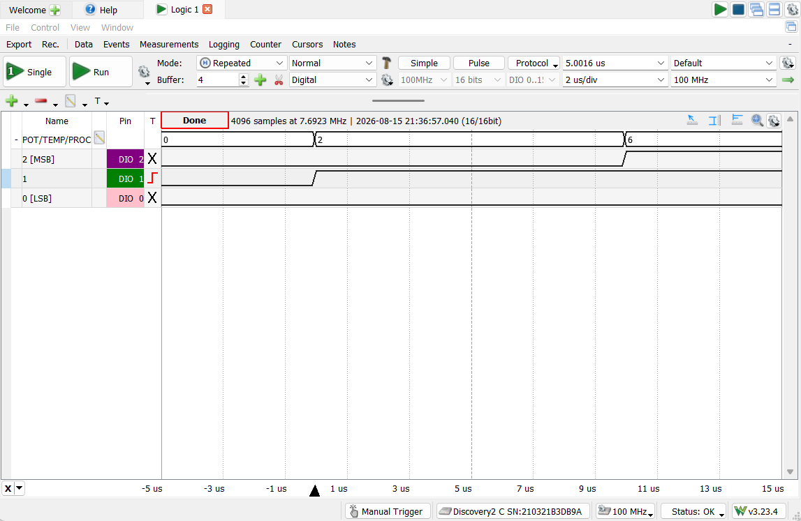
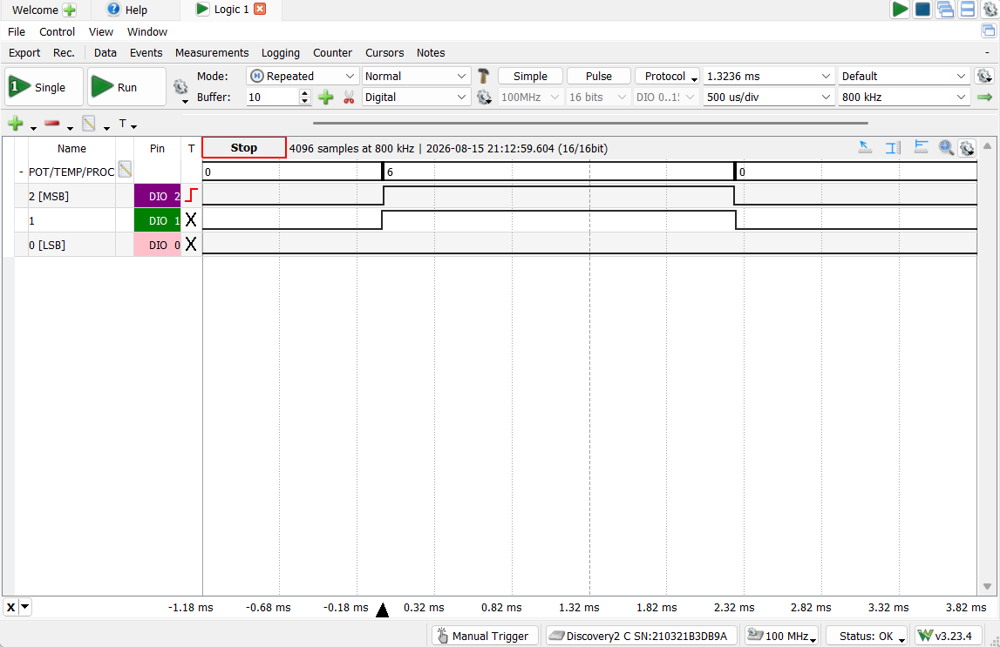

# Multi Sensor Hub

A FreeRTOS-based multi-sensor acquisition pipeline on the TM4C123GH6PM. Two
independent ADC producer tasks - a potentiometer and the TM4C's itnernal die temperature sensor - each sample on a fixed period and signal a FreeRTOS
event group. A single processing task blocks until both readings are
available, converts the temperature to Celsius, and logs both values over
UART, with access to UART serialized by a mutex.

## What it demonstrates
- Multi-producer synchronization via a FreeRTOS event group
  (`xEventGroupSetBits()` / `xEventGroupWaitBits` with a wait-for-all
  pattern), rather than a queue - appropriate here since the consumer needs
  the latest value from each source, not a first-in-first-out stream of
  individual events
- Dual ADC sequencer use on ADC0: sequencer 3 for an external analog input
  (potentiometer, PE3/AIN0) and sequencer 2 for the TM4C's internal
  temperature sensor channel (`ADC_CTL_TS`), sampled independently
- Mutex-protected access to a shared UART resource, called directly from the
  consumer task rather than through a dedicated printing task
- Static/pool-only memory allocation, enforced by trapping the standard 
  `malloc()`
- Debugging GPIO instrumentation added specifically to make an internal
  synchronization primitive (the event group) externally observable on a
  logic analizer - including catching a real task-priority preemption effect
  in the process (see Deisgn notes below)

## Architecture
Two independent producer tasks each sample their own ADC sequencer on a
fixed 500ms period:

- **`prvPotentiometerTask`** - triggers ADC0 sequencer 3, reads the 12-bit
  result from PE3 (AIN0), and sets `EVENT_BIT_POT` in the event group.
- **`prvTemperatureSensorTask`** - triggers ADC0 sequencer 2 (the internal
  temperature sensor channel), reads the raw result, and sets
  `EVENT_BIT_TEMP`.

Both tasks run at the same priority and are not synchronized with each
other - they simply sample and set their bit whenever their own 500ms
period elapses. `prvProcessingTask` (higher priority) blocks until both bits
are set, consuming no CPU cycles while idle. Once both are set (cleared
automatically on exit), it converts the raw temperature sample to Celsius
using the TM4C123's internal sensor transfer function, then takes `xMutex`
to print both readings over UART0 in a single line.

Because the two producer tasks are not phase-locked, the gap between "value
A is fresh" and "value B is fresh" varies from cycle to cycle - the event
group handles this correctly by waiting for whichever bit is slower to
arrive, which is the behavior the debug pin captures below are meant to
prove.

## Hardware setup
- **Board**: TM4C123GXL Launchpad (TM4C123GH6PM)
- **Potentiometer**: External 10k potentiometer, wiper on PE3 (ADC0 AIN0),
outer legs to 3.3V and GND
- **Temperature sensor**: none external - uses the TM4C123's internal die
temperature sensor (ADC0, `ADC_CTL_TS`)
- **UART**: UART0 on PA0 (TX) / PA1 (TX), 115200 8-N-1
- **Debug/verification pins (PC4-PC6)**: added solely to make the event
group's internal synchronization visible on a logic analyzer (Digilent
Analog DIscovery 2/ WaveForms), since tehre's no external pin activity to
probe otherwise. These mirror existing task events that are not part of
the project's core functionality:
- PC4 (DIO0) - potentiometer sample event pulse
- PC5 (DIO1) - temperature sample event pulse
- PC6 (DIO2) - processing task active (high for the diration of the
conversion + UART print)

## Verified behavior

### UART sensor log

*Captured terminal output showing interleaved potentiometer and temperature
readings, updating roughly every 500ms as both ADC sequencers complete.*

### Individual event pulses

*DIO0 (PC4), rising-edge triggered — a clean, few-microsecond-wide blip
corresponding to the single `xEventGroupSetBits()` call in
`prvPotentiometerTask`.*

*DIO1 (PC5), rising-edge triggered — same short blip behavior as the
potentiometer pulse. This capture also caught the priority-preemption
overlap with DIO2 described below.*

### Event group priority preemption

*DIO1 (PC5) and DIO2 (PC6) briefly high together. The instant
`prvTemperatureSensorTask` calls `xEventGroupSetBits()` and satisfies the
wait condition, the higher-priority `prvProcessingTask` preempts it
immediately — before the temperature task reaches its own `GPIOPinWrite()`
call to clear PC5. PC5 only drops once `prvProcessingTask` finishes and the
temperature task resumes. Reproduced twice, confirming this is consistent,
expected behavior rather than a one-off artifact.*

## Design notes / known limitations

- **Event group chosen over a queue by design**: unlike `unified_event_logger`
  (where multiple independent event occurrences funnel through a queue to
  be processed one at a time), this project's consumer needs the latest
  value from each of two ongoing streams, not a backlog of past samples. An
  event group with a wait-for-ALL pattern is the better fit — it naturally
  discards stale bit state and only unblocks once both sources have
  reported fresh data.
- **Task priority causes a brief, expected pin overlap**: because
  `prvProcessingTask` runs at a higher priority than the two producer
  tasks, it preempts a producer task mid-function the moment that producer's
  `xEventGroupSetBits()` call satisfies the wait condition — before that
  producer gets to execute its own pin-clear instruction. This means the
  producer's debug pin and the processing task's debug pin can briefly read
  high at the same time. It's a real, correct consequence of preemptive
  scheduling and task priority, not a bug in the debug instrumentation.
- **No phase-locking between producer tasks**: `prvPotentiometerTask` and
  `prvTemperatureSensorTask` each run on their own independent 500ms
  `vTaskDelay()`, so which one finishes first varies cycle to cycle. The
  event group's wait-for-ALL behavior handles this correctly regardless of
  arrival order.
- **UART mutex is shared but taken directly**: `prvProcessingTask` is
  currently the only task that ever prints, so the mutex isn't strictly
  required today — it's included as correct practice in case the project
  is extended with another UART-printing source later.
- **Static allocation only**: `malloc()` is intentionally trapped to halt
  execution if called, since the project relies entirely on FreeRTOS's own
  heap (`pvPortMalloc`) for all task/event-group/semaphore creation — a
  deliberate fail-loud safety pattern rather than an oversight.

## How to build / run

**Toolchain**: Code Composer Studio (CCS), TivaWare C Series
(2.2.0.295), TM4C123GH6PM target.

**Prerequisites**:
- CCS with TivaWare C Series installed
- A local FreeRTOS source tree (this project was built against
  FreeRTOS's TivaWare CCS port; not included in this repository —
  download from [freertos.org](https://www.freertos.org))

1. Import this project folder into CCS as an existing project.
2. Ensure project include paths point to your local FreeRTOS and
   TivaWare installations (Project Properties → Build → Includes).
3. Wire a 10k potentiometer's wiper to PE3, outer legs to 3.3V/GND.
4. Build and flash to a TM4C123GXL Launchpad.
5. Open a serial terminal (e.g., PuTTY) at 115200 baud, 8-N-1, to see
   sensor readings appear roughly every 500ms.
