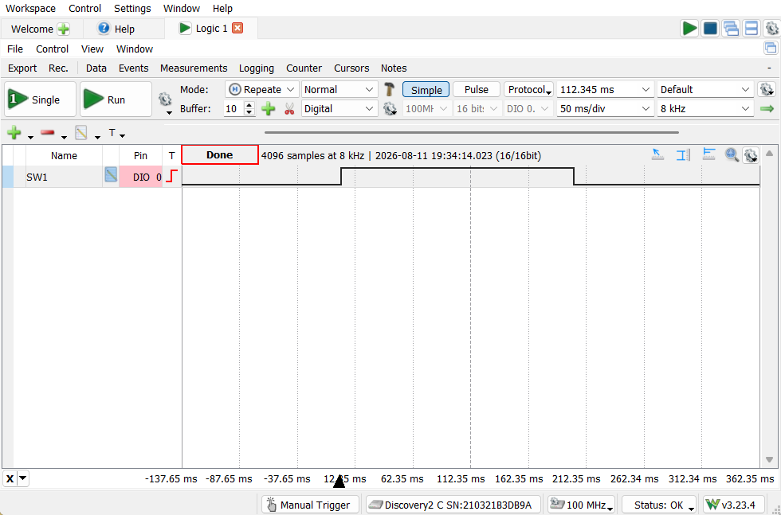
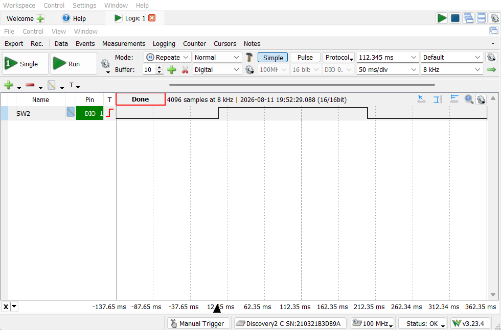
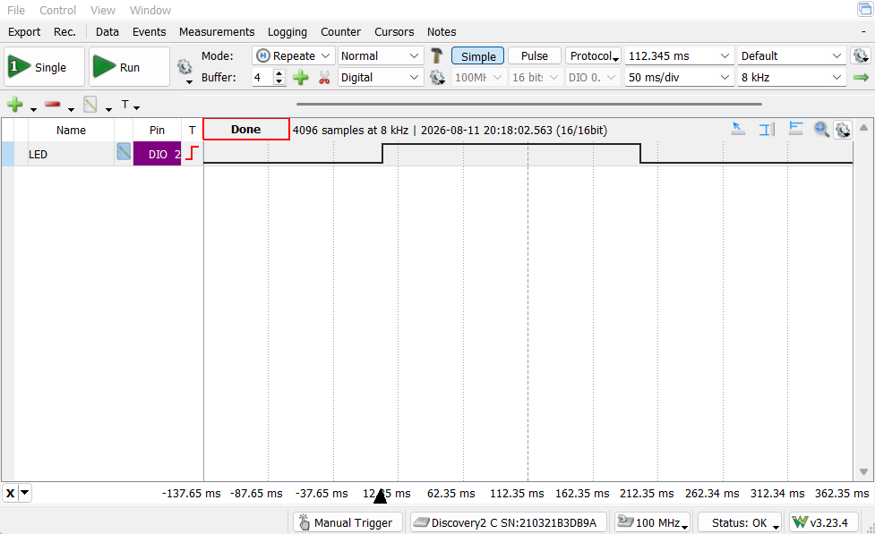
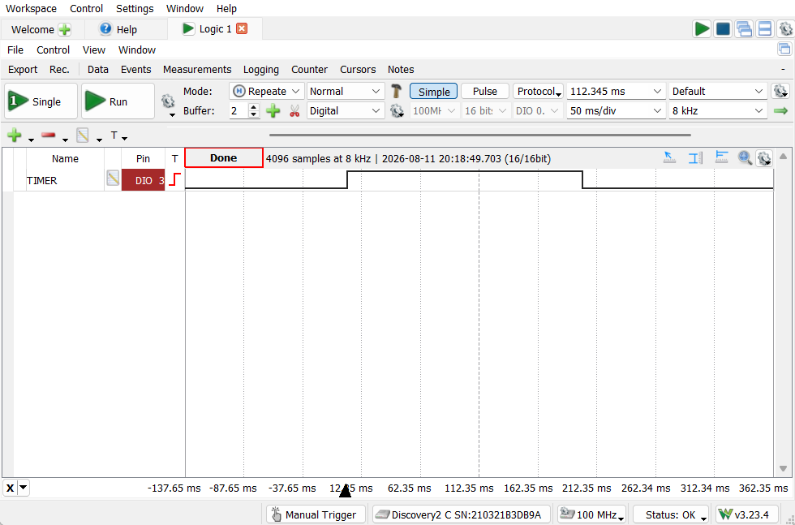
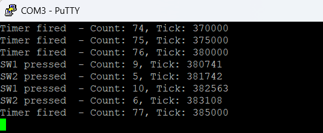

# Unified Event Logger

A FreeRTOS-based event logging system on the TM4C123GH6PM. Two debounced
GPIO button interrupts and a recurring software timer act as independent
event sources, all funneling through a single queue into one consumer task,
which counts, indicates via onboard LED, and logs each event via UART.

## What it demonstrates
- Many-producer, one-consumer event handling via a FreeRTOS queue
- ISR-to-task signaling using `xQueueSendFromISR()` and `portYIELD_FROM_ISR()`
- Periodic, non-blocking behavior via a FreeRTOS software timer (`xTimerCreate`)
- Mutex-protected access to a shared resource (UART) across multiple event sources
- Hardware button debounce handled in ISR context
- Static/pool-only memory allocation, enforced by trapping the standard `malloc()`

## Architecture
Three independent sources generate events:

- **SW1 / SW2 buttons** — GPIO interrupts (`xButtonsHandler`) detect a
  press, apply a 200ms software debounce, and send an event struct into
  the queue via `xQueueSendFromISR()`.
- **Status timer** — a FreeRTOS software timer fires every 5000ms
  (`prvStatusTimerCallback`), sending its own event into the same queue
  via `xQueueSend()`.

All three sources feed a single queue (`xEventQueue`), decoupling *who
detected an event* from *who handles it*. One consumer task
(`prvEventHandlerTask`) blocks on `xQueueReceive(..., portMAX_DELAY)`,
consuming no CPU while idle. When an event arrives, it increments a
per-event counter, pulses the corresponding onboard LED, and prints a
timestamped status line to UART — with access to UART serialized by a
mutex (`xUARTMutex`) to prevent interleaved output if extended to
multiple printing tasks in the future.

## Hardware setup
- **Board**: TM4C123GXL Launchpad (TM4C123GH6PM)
- **SW1 / SW2**: onboard buttons (PF4 / PF0)
- **RGB LED**: onboard LED (PF1 / PF2 / PF3 — red / blue / green)
- **UART**: UART0 on PA0 (RX) / PA1 (TX), 115200 8-N-1
- **Debug/verification pins (PC4–PC7)**: added solely to make internal
  timing visible on a logic analyzer, since the onboard button/LED pins
  are too small to probe directly. These mirror existing signals and are
  not part of the project's core functionality:
  - PC4 — SW1 press pulse
  - PC5 — SW2 press pulse
  - PC6 — LED active pulse
  - PC7 — timer event detected pulse

## Verified behavior

### Button press → event pulse
Logic analyzer captures showing a clean rising edge on button press and
falling edge once the event finishes processing, confirming the debounce
and ISR-to-task path work as designed.

*PC4 (SW1) — rising edge on press, falling edge once `prvEventHandlerTask`
finishes handling the event.*

*PC5 (SW2) — same behavior, independent button.*

### LED and timer events

*PC6 — pulses high for the duration of `LED_PULSE_MS` (200ms) each time
any event is handled.*

*PC7 — pulses the moment `EVENT_TIMER` is handled, firing independently
of any button press.*

### UART event log

*Captured terminal output showing all three event types interleaved.
Timer fire ticks land exactly 5000 ticks apart (370000 → 375000 → 380000
→ 385000), confirming the 5-second status timer period is accurate.*

## Design notes / known limitations

- **Debounce timing bug (found and fixed)**: the debug pins (PC4/PC5)
  were initially cleared at the *start* of the next button ISR call
  rather than when the task finished handling the current event. This
  meant a single press would leave the pin stuck high indefinitely until
  another button interrupt happened to clear it. Fixed by moving the
  clear into `prvEventHandlerTask`, right after that event's handling
  completes — tying the pin's state directly to the event's actual
  lifetime instead of an unrelated future interrupt.

- **Simultaneous button press edge case**: both SW1 and SW2 share the
  same GPIO interrupt (`INT_GPIOF`) and are resolved with an `if/else`
  in `xButtonsHandler`. If both buttons were pressed at the exact same
  instant, only `EVENT_SW1` would be generated — `EVENT_SW2` would be
  silently dropped for that interrupt. Not a practical concern for human
  button presses, but a real limitation of the current logic.

- **UART mutex is defensive, not currently required**: since only one
  task (`prvEventHandlerTask`) ever calls `UARTprintf()`, there's no
  actual concurrent access today. The mutex is included as correct
  practice in case the design is later extended to multiple
  UART-printing tasks.

- **Static allocation only**: the standard `malloc()` is intentionally
  trapped to halt execution if called, since the project relies entirely
  on FreeRTOS's own heap (`pvPortMalloc`) for all task/queue/timer
  creation — a deliberate fail-loud safety pattern rather than an
  oversight.

## How to build / run

**Toolchain**: Code Composer Studio (CCS), TivaWare C Series
(2.2.0.295), TM4C123GH6PM target.

**Prerequisites**:
- CCS with TivaWare C Series installed
- A local FreeRTOS source tree (this project was built against
  FreeRTOS's TivaWare CCS port; not included in this repository —
  download from [freertos.org](https://www.freertos.org))

1. Import this project folder into CCS as an existing project.
2. Ensure project include paths point to your local FreeRTOS and
   TivaWare installations (Project Properties → Build → Includes).
3. Build and flash to a TM4C123GXL Launchpad.
4. Open a serial terminal (e.g., PuTTY) at 115200 baud, 8-N-1.
5. Press SW1 or SW2, or wait up to 5 seconds, to see event logs appear.